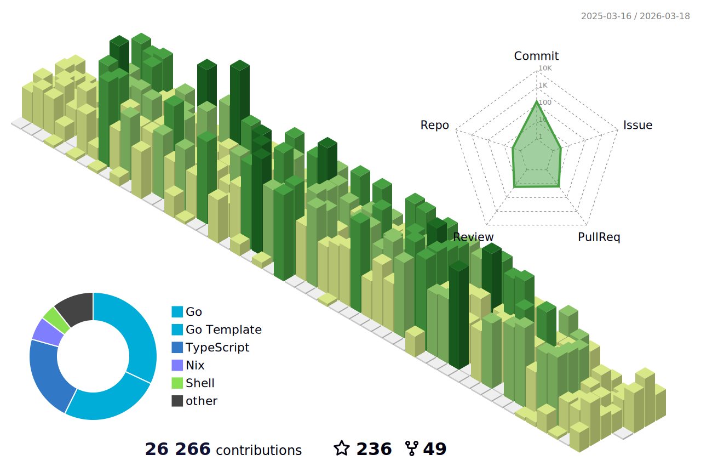

<h2 align="center">👋 Hello! I'm Lucas.</h2>
<p align="center">
  <a href="https://www.lucassabreu.net.br/">Blog</a> •
  <a href="https://twitter.com/lucassabreu">Twitter</a> •
  <a href="https://www.linkedin.com/in/lucassantosabreu/">Linkedin</a>
</p>

---

Working as a developer at [Coderockr](https://github.com/Coderockr)

---

**📝 Latest Blog Posts**

<!-- BLOG-POST-LIST:START -->
- [Github Actions](https://www.lucassabreu.net.br/post/github-actions/)
- [Aplicando HTTPS para uma SPA na AWS](https://www.lucassabreu.net.br/post/aplicando-https-para-uma-spa-na-aws/)
- [Ambientes por Branch com OpenShift Next Gen usando GitHub](https://www.lucassabreu.net.br/post/ambientes-por-branch-com-openshift-next-gen-usando-github/)
<!-- BLOG-POST-LIST:END -->

---

📊 **Weekly development breakdown**
<!--START_SECTION:waka-->
```text
PHP            ████████████████████░░░░░░░░░░░░░░░░░░░░░   48.63 % 
apiblueprint   ███░░░░░░░░░░░░░░░░░░░░░░░░░░░░░░░░░░░░░░   06.94 % 
JSON           ██▓░░░░░░░░░░░░░░░░░░░░░░░░░░░░░░░░░░░░░░   06.49 % 
Go             ██▓░░░░░░░░░░░░░░░░░░░░░░░░░░░░░░░░░░░░░░   06.45 % 
Makefile       ██▒░░░░░░░░░░░░░░░░░░░░░░░░░░░░░░░░░░░░░░   05.75 % 
```
<!--END_SECTION:waka-->

---


