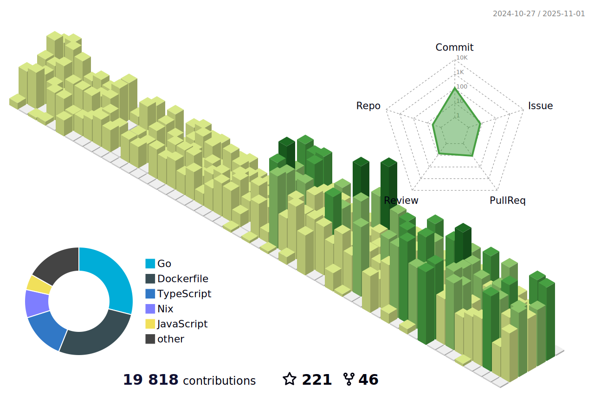

<h2 align="center">👋 Hello! I'm Lucas.</h2>
<p align="center">
  <a href="https://www.lucassabreu.net.br/">Blog</a> •
  <a href="https://twitter.com/lucassabreu">Twitter</a> •
  <a href="https://www.linkedin.com/in/lucassantosabreu/">Linkedin</a>
</p>

---

Bachelor's Degree in Information Systems at [UNIVILLE](https://www.univille.edu.br//en/index/593619) (2016).
I have a passion for web development

Working as a developer at [Coderockr](https://github.com/Coderockr)

---

**📝 Latest Blog Posts**

<!-- BLOG-POST-LIST:START -->
- [Github Actions](https://www.lucassabreu.net.br/post/github-actions/)
- [Aplicando HTTPS para uma SPA na AWS](https://www.lucassabreu.net.br/post/aplicando-https-para-uma-spa-na-aws/)
- [Ambientes por Branch com OpenShift Next Gen usando GitHub](https://www.lucassabreu.net.br/post/ambientes-por-branch-com-openshift-next-gen-usando-github/)
<!-- BLOG-POST-LIST:END -->

---

📊 **Weekly development breakdown**
<!--START_SECTION:waka-->
```text
PHP            ████████████████████▒░░░░░░░░░░░░░░░░░░░░   49.41 % 
Markdown       ████████▓░░░░░░░░░░░░░░░░░░░░░░░░░░░░░░░░   20.79 % 
TypeScript     ███░░░░░░░░░░░░░░░░░░░░░░░░░░░░░░░░░░░░░░   07.70 % 
apiblueprint   ███░░░░░░░░░░░░░░░░░░░░░░░░░░░░░░░░░░░░░░   07.66 % 
Bash           █▓░░░░░░░░░░░░░░░░░░░░░░░░░░░░░░░░░░░░░░░   04.44 % 
```
<!--END_SECTION:waka-->

---



<!-- vim: spelllang=en
